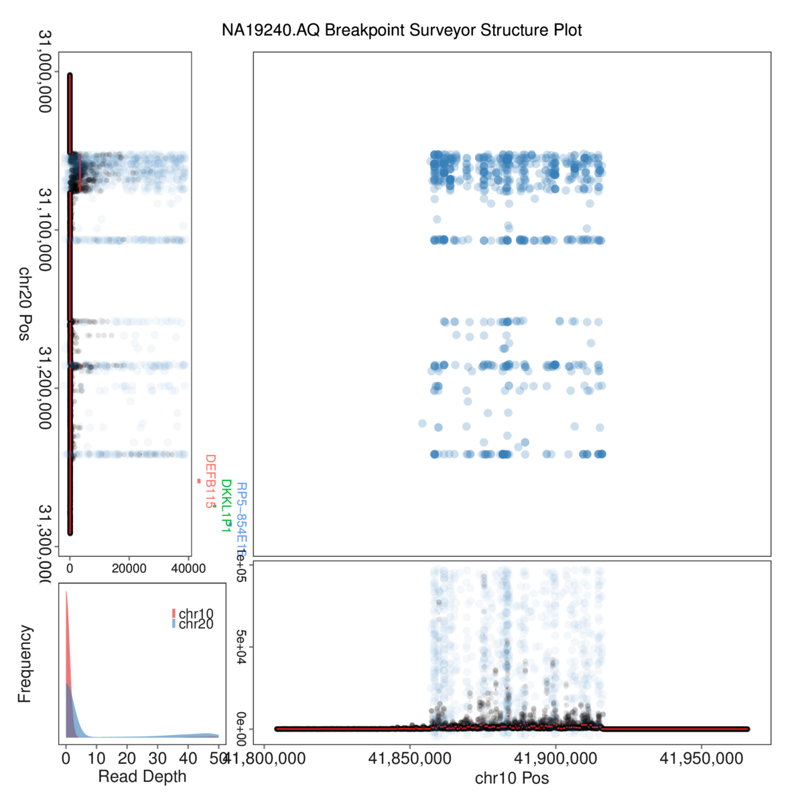
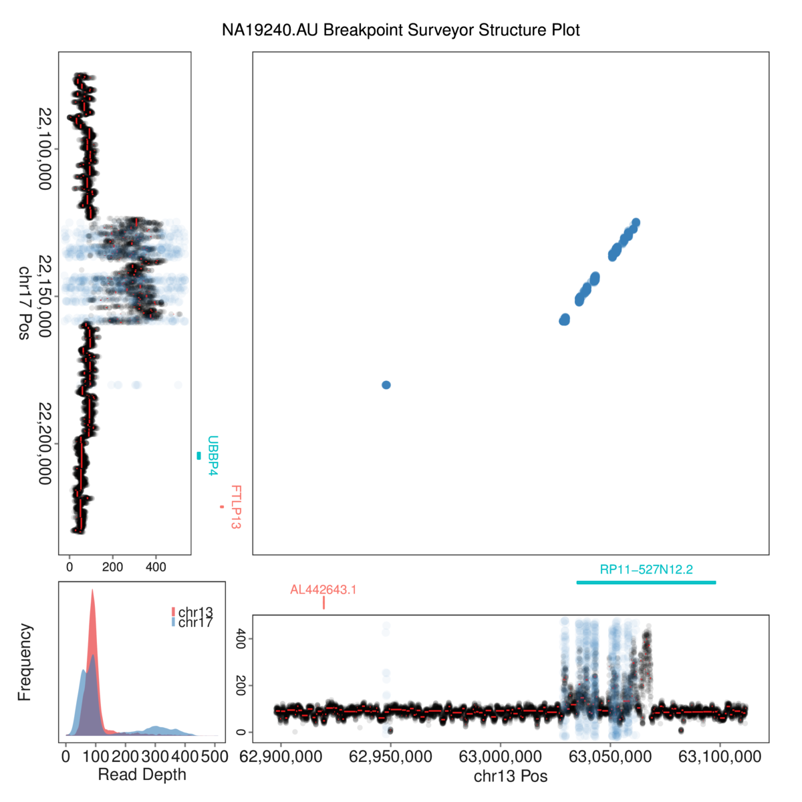

# BreakPointSurveyor: 1000SV branch

*A comprehensive pipeline to analyze and visualize structural variants in 1000 Genomes dataset*

See [TCGA_Virus](https://github.com/ding-lab/BreakPointSurveyor) workflow for comprehensive documentation.

## Overview

The 1000SV workflow investigates interchromosomal human-human breakpoints in a
publicly available human sample from the 1000 Genomes project,
[NA19240](http://www.internationalgenome.org/data-portal/sample/NA19240), which
was sequenced at high (80X) coverage.

The analysis focuses on two events with interchromosal discordant reads:
* "AQ" event: chr10:41854249-41915847 to chr20:31051980-31241883	
* "AU" event: chr13:62947705-63061713 to chr17:221247350-22180085	

To simplify and speed up downstream processing, a new sequence dataset (BAM
file) with only the chromosomes of interest is created, though it is not
distributed due to its size.  Expression analalysis is not performed in the
1000SV workflow.

## Results

The 1000SV workflow focuses on two regions with a cluster of interchromosomal
human-human breakpoints.  Preliminary analysis of discordant clusters allowed
us to identify two regions of interest for further analysis.

### AQ Event

The "AQ" event occurs between genomic regions chr10:41854249-41915847 and chr20:31051980-31241883.

AQ event has a discordant read signature which is frequently observed: no
correlation between discordant read positions on the two chromosomes and a
spike in copy number.  This likely represents anomalous mapping between two
repetitive regions.

### AU Event

"AU" event occurs between genomic regions chr13:62947705-63061713 and chr17:221247350-22180085.

This event has a very different discordant read pattern than AQ, with the reads falling cleanly on a diagonal.  
This event is likely to be a tandem duplication.  The discordant reads on Chr13 fall on “gene” RP11-527N12.2,
which [is consistent with this interpretation](https://www.biostars.org/p/51456/).

The BPS Structure plots of events AQ and AU clearly illustrate how visualizing discordant reads as coordinates 
on a plane yields patterns and interpretations which would not be discernable in other representations.

## Workflow

Stages associated with 1000SV workflow:

* **[A_Reference](A_Reference/README.md)**: Download GRCh38 human reference and associated files.
* **[B_ExonGene](B_ExonGene/README.md)**: Reference-specific analysis and files.
* **[C_Project](C_Project/README.md)**: Create list of sample WGS BAMs and references.
* **[G_Discordant](G_Discordant/README.md)**: Process realigned BAM file to extract discordant reads.
* **[H_PlotList](H_PlotList/README.md)**: Generate PlotList to define regions for plotting.
* **[K_ReadDepth](K_ReadDepth/README.md)**: Evaluate read depth in target regions.
* **[N_DrawBreakpoint](N_DrawBreakpoint/README.md)** Draw breakpoints with coordinates given by posA, posB.
* **[O_DrawDepth](O_DrawDepth/README.md)** Create read depth/copy number panel GGP and add breakpoint predictions
* **[P_DrawAnnotation](P_DrawAnnotation/README.md)** Create annotation panel GGP showing genes and exons
* **[Q_DrawHistogram](Q_DrawHistogram/README.md)**: Create histogram panel GGP showing distribution of read depth
* **[T_PlotStructure](T_PlotStructure/README.md)**: Assemble GGP panels into BPS structure plot and save as PDF and PNG files.

## Installation

[Installation instructions](https://github.com/ding-lab/BreakPointSurveyor/blob/master/INSTALL.md).  Besides the core libraries, also install,
* BWA

## Performance
* C_Project: 128 sec
* G_Discordant: 16 sec
* H_PlotList: 12 hours (clustering is time consuming)
* K_ReadDepth: 55 sec
* N_DrawBreakpoint - T_PlotStructure: 73 sec
