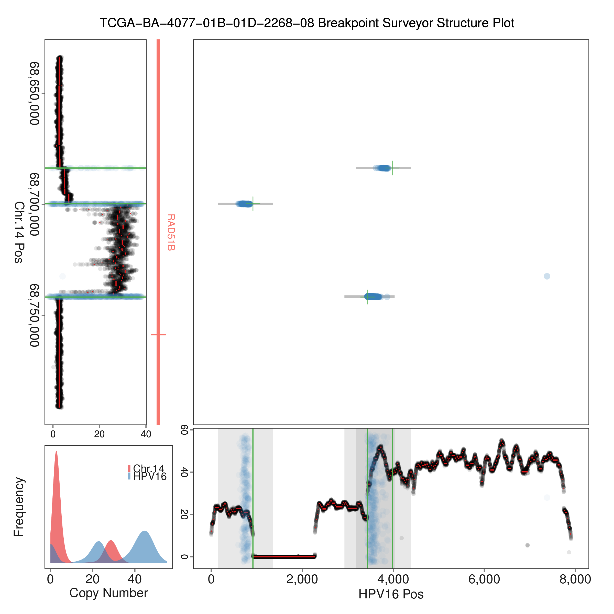
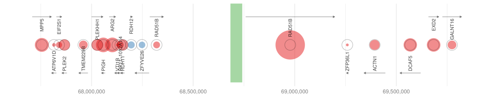
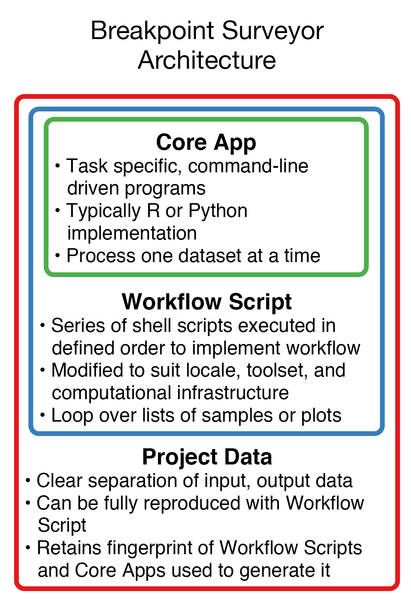
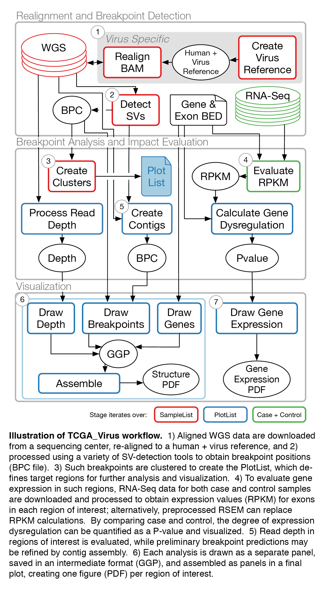

#  BreakPointSurveyor

*A comprehensive pipeline to analyze and visualize structural variants*

This is the `master` branch which implements the TCGA_Virus workflow.

## Overview

BreakPointSurveyor (BPS) is a set of core libraries
([BreakPointSurveyor-Core](https://github.com/ding-lab/BreakPointSurveyor-Core)) and 
workflows ([this project](https://github.com/ding-lab/BreakPointSurveyor)) which, with optional external tools,
evaluate genomic sequence data to discover, analyze, and provide a visual summary of
breakpoint events.

The BreakPointSurveyor project provides three reference workflows, each implemented as a separate [git
branch](https://git-scm.com/book/en/v2/Git-Branching-Branches-in-a-Nutshell).
These workflows (and the links to view them) are:

* **TCGA_Virus** ([`master` branch](https://github.com/ding-lab/BreakPointSurveyor)):  Comprehensive workflow and data for one
  TCGA virus-positive sample
  ([TCGA-BA-4077-01B-01D-2268-08](https://gdc-portal.nci.nih.gov/legacy-archive/files/6533e56c-b5b8-4c85-862b-a5526c5c2e0a))
  which has been aligned to a custom reference
* **1000SV** ([`1000SV` branch](https://github.com/ding-lab/BreakPointSurveyor/tree/1000SV)): Analysis of discordant reads on publicly available human sample 
* **Synthetic** ([`Synthetic` branch](https://github.com/ding-lab/BreakPointSurveyor/tree/Synthetic)): Creation and analysis of a small dataset containing inter-chromosomal and intra-chromosomal breakpoints 

**Citation** 

Matthew A. Wyczalkowski, Kristine M. Wylie, Song Cao, Michael D. McLellan, Jennifer Flynn, Mo Huang, Kai Ye, Xian Fan, Ken Chen, Michael C. Wendl, Li Ding; *BreakPoint Surveyor: A Pipeline for Structural Variant Visualization*. Bioinformatics 2017. doi: 10.1093/bioinformatics/btx362

[Online preprint with supplemental information.](https://academic.oup.com/bioinformatics/article/3861338/BreakPoint-Surveyor-A-Pipeline-for-Structural) 

## Getting Started

Download BreakPointSurveyor with three example workflows with,

``` git clone --recursive  https://github.com/ding-lab/BreakPointSurveyor.git ```

See [here](./INSTALL.md) for detailed installation instructions.  The [Getting started with the Synthetic branch](#getting_started) section has
instructions on working with a relatively small test dataset.  See also the [BPS developer guide](Development.md)
for information about implementing your own workflow.

## Output

BPS generates two types of plots: *structure plots* and *expression plots*.  Figures below are generated by
the TCGA-Virus workflow.

### Structure Plots

Structure plots visualize breakpoints as points with X,Y coordinates given by the breakpoint position
along each chromosome.  Such figures also display read depth, gene and exon annotations, and a copy 
number histogram.  In this workflow, read depth and discordant reads are obtained from aligned WGS data, and calls from
various structural variant tools shown.  Breakpoint predictions from other tools, whether from WGS or RNA-Seq data, can 
be readily integrated into the structure plot.



See [T_PlotStructure](T_PlotStructure/README.md) for interpretation and details.

### Expression Plots

Expression plots illustrate relative gene expression near breakpoints, with gene position, size, orientation, and name shown.
Expression is obtained for the sample and a population of controls from either processed expression data (e.g., TCGA RSEM) or RNA-Seq 
data directly.



See [U_PlotExpression](U_PlotExpression/README.md) for interpretation and details.

## Design

### Architecture

There are three layers of BreakPoint Surveyor project:

* BPS Core: core analysis and plotting, typically in R or Python
* BPS Workflow: Project- and locale-specific workflows. Mostly as BASH scripts
* BPS Data: BPS-generated secondary data, graphical objects, and plots



For convenience, the workflows demonstrated here combine the Workflow and Data layers; also, the Core
layer is implemented as a submodule and downloaded together with this project.

### Workflow

The BPS workflow consist of a series of directories, each of which implements a stage
in the BPS workflow. The order of processing indicated by the stage 
prefix. The figure below illustrates the stages and their relationship in the
TCGA_Virus workflow.



#### Workflow Stages

Below is a list of the stages associated with the TCGA_Virus workflow (`master` branch) and their description:

* **[A_Reference](A_Reference/README.md)**: Reference-specific analysis and files.
* **[B_ExonGene](B_ExonGene/README.md)**: Generate exon and gene definitions files.
* **[C_Project](C_Project/README.md)**: Create list of BAMs, both realigned WGS and RNA-Seq.  Create BAMs in `Synthetic` branch.
* **[F_PindelRP](F_PindelRP/README.md)**: Run Pindel and process breakpoint predictions.
* **[G_Discordant](G_Discordant/README.md)**: Process realigned BAM file to extract discordant human-virus reads
* **[H_NovoBreak](H_NovoBreak/README.md)**: Identify breakpoint with novoBreak
* **[I_Contig](I_Contig/README.md)**: Create contigs using Tigra-SV and realign them
* **[J_PlotList](J_PlotList/README.md)**: Identify target regions for further processing and visualization
* **[K_ReadDepth](K_ReadDepth/README.md)**: Evaluate read depth in target regions, obtain BAM file statistics for both WGS and RNA-Seq data
* **[L_Expression](L_Expression/README.md)**: Analyze expression in vicinity of integration events using RNA-Seq data. (`master` branch only)
* **[M_RSEM_Expression](M_RSEM_Expression/README.md)**: Analyze expression in vicinity of integration events using TCGA RSEM data. (`master` branch only)
* **[N_DrawBreakpoint](N_DrawBreakpoint/README.md)** Plot breakpoint coordinates from various predictors to breakpoint panel GGP.
* **[O_DrawDepth](O_DrawDepth/README.md)** Create read depth/copy number panel GGP and add breakpoint predictions
* **[P_DrawAnnotation](P_DrawAnnotation/README.md)** Create annotation panel GGP showing genes and exons
* **[Q_DrawHistogram](Q_DrawHistogram/README.md)**: Create histogram panel GGP showing distribution of read depth
* **[T_PlotStructure](T_PlotStructure/README.md)**: Assemble GGP panels into BPS structure plot and save as PDF
* **[U_PlotExpression](U_PlotExpression/README.md)**: Create BPS Expression plot based on expression P-values and save as PDF (`master` branch only)

The 1000SV and Synthetic workflows generally have a subset of these stages. See [BPS Developer Guide](Development.md)
for additional information about developing new workflow stages. The [BreakPointSurveyor-Core](https://github.com/ding-lab/BreakPointSurveyor-Core)
project (distributed as a submodule of this project) has details about BPS utilities underlying these stages.

## Data Availability 

Genomic datasets tend to be very large and frequently have restrictions
on access and distribution.  Each of the three workflows operates on distinct datasets
of various size, clinical relevance, and availability, to demonstrate different BreakPointSurveyor capabilities.

In general, the workflows include all intermediate data which is allowed to be distributed and which is not prohibitively large.

### TCGA_Virus workflow (`master` branch)

The TCGA_Virus workflow provides an in-depth analysis of a virus integration event in the TCGA WGS sample 
([TCGA-BA-4077-01B-01D-2268-08](https://gdc-portal.nci.nih.gov/legacy-archive/files/6533e56c-b5b8-4c85-862b-a5526c5c2e0a)),
which is a head and neck cancer sample.  Because of TCGA restictions we do not distribute any sequence data.
After downloadeding, sequence data was aligned to a custom reference which includes human and virus sequences ([details](A_Reference/README.md)).
We do not distribute the reference because of size constraints.  

Relative expression calcuations require a case and a population of controls.  We provide two examples of expression calculations:

* Expression calculated directly from RNA-Seq data (RPKM)
* Expression obtained from a precomputed matrix of expression (TCGA RSEM)

### 1000SV Workflow

The 1000SV workflow investigates interchromosomal human-human breakpoints in a
publicly available human sample from the 1000 Genomes project,
[NA19240](http://www.internationalgenome.org/data-portal/sample/NA19240), which
was sequenced at high (80X) coverage; this 65Gb file [can be downloaded
here](http://ftp.1000genomes.ebi.ac.uk/vol1/ftp/data_collections/hgsv_sv_discovery/data/YRI/NA19240/high_cov_alignment/NA19240.alt_bwamem_GRCh38DH.20150715.YRI.high_coverage.cram).  

The analysis focuses on two events with interchromosal discordant reads.
Expression analalysis is not performed in the 1000SV workflow.  We demonstrate
using attributes to provide additional information about discordant reads.


### Synthetic Workflow

The Synthetic workflow generates a simple interchromosomal breakpoint and a
corresponding small, synthetic dataset which can be analyzed and visualized in
BPS.  We create a custom reference, consisting only of the chromosomes of
interest, for improved performance (this reference is not distributed due to
size).

We then generate a breakpoint sequence from sections of the human reference,
and synthetic (simulated) reads are create.  These are re-aligned to the custom
reference.  The resulting BAM file is then analyzed similarly to the 1000SV
workflow.  Expression analysis is not performed in the Synthetic workflow.

The Synthetic branch also illustrates more elaborate exon/gene annotations as well
as an intrachromosomal inversion/duplication event.


#### Getting started with the Synthetic workflow <a name="getting_started"></a>

The Synthetic workflow utilizes a relatively small dataset which is created
from scratch, and can be run relatively quickly on a laptop computer.  It is a
good place to start working with BPS.  

There are a number of dependencies you'll need to install to get stated.  You'll
need the Core dependencies and as well as BWA, [described here](INSTALL.md).

Get a fresh copy of BPS and switch to the `Synthetic` branch with,

```
git clone --recursive  https://github.com/ding-lab/BreakPointSurveyor.git
git checkout Synthetic
```

Next, edit `bps.config` to locate the installed software. 

The idea is to run each stage in order according to its first letter. You can run
an entire stage with,

```./run_bps A_Reference ```

Each of these eleven stages consists of one or more steps.  These steps are named starting with a number
(e.g., `1_get_BAM_paths.sh`), and consist of shell scripts which execute a specific task.  See the 
documentation for each stage, as well as the contents of each step's script file, for details 
about implementation and debugging.

## Performance:

### TCGA_Virus

Performance per stage for TCGA_Virus branch, obtained with `run_BPS <STAGE>`.  

* A_Reference B_ExonGene C_Project: <1 seconds
* F_PindelRP: 124 seconds 
* G_Discordant: 3800 seconds
* H_NovoBreak: 1614 seconds
* I_Contig: 210 seconds
* J_PlotList: 666 seconds
* K_ReadDepth: 3329 seconds
* L_Expression: 1602 seconds
* M_RSEM_Expression: 649 seconds
* N_DrawBreakpoint O_DrawDepth P_DrawAnnotation Q_DrawHistogram T_PlotStructure U_PlotExpression: 20 seconds

## Authors
Matthew A. Wyczalkowski, m.wyczalkowski@wustl.edu

## License
This software is licensed under the GNU General Public License v3.0

## Acknowledgements
This work was supported by the National Cancer Institute [R01CA178383 and
R01CA180006 to Li Ding, R01CA172652 to Ken Chen]; and National Human Genome Research
Institute [U01HG006517 to Li Ding]. 
