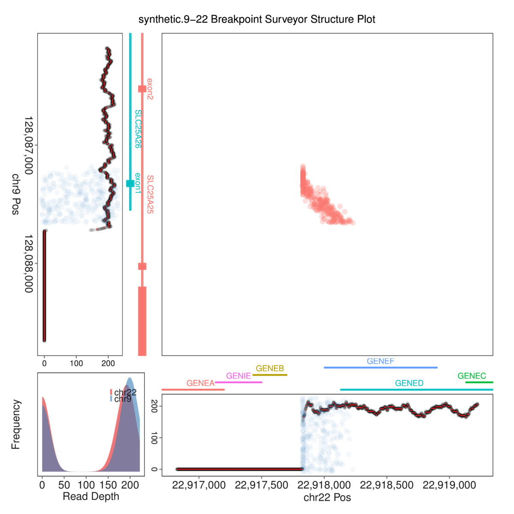

# AssembleBPS

*Assemble GGP panels into BPS structure plot and save as PDF and PNG files*

All GGP panels required for the structure plot are aligned and assembled into
a composite figure and saved as PDF.  The PDF is then converted to a PNG file.

See [TCGA_Virus workflow](https://github.com/ding-lab/BreakPointSurveyor/blob/master/T_PlotStructure/README.md) for interpretation of structure plots.

Structure plot below illustrates discordant reads mapping to a junction between chr 9 and 22, together with copy number
in that region. We also demonstrate gene and exon annotation functionality, including exon labels, with synthetic genes and exons.

