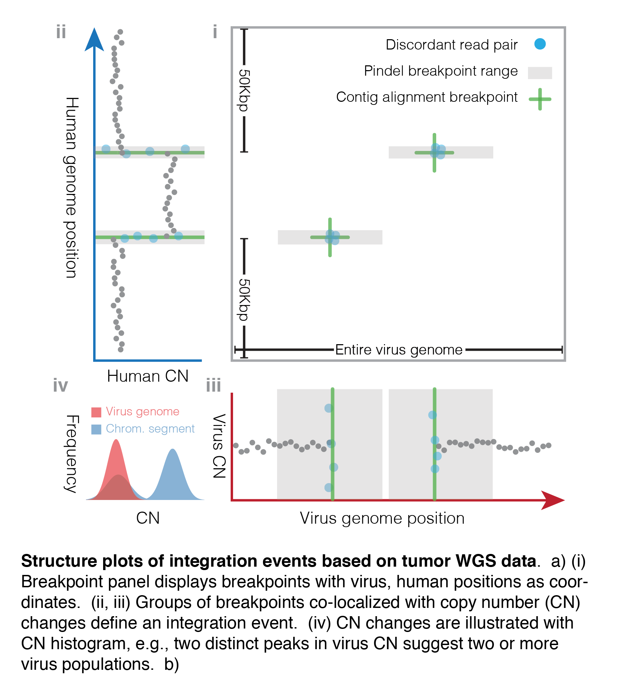
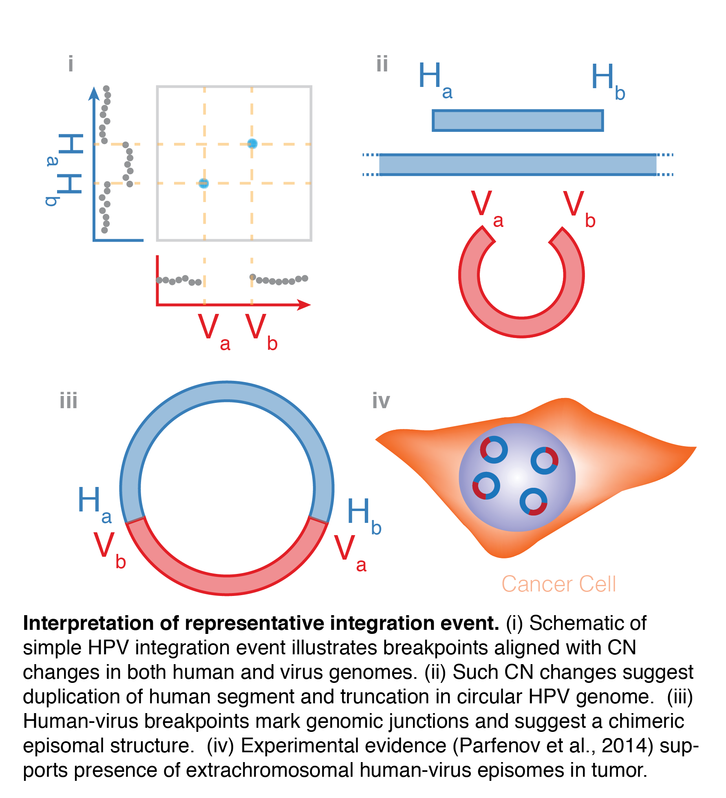

# BPS Structure Plot

*Assemble GGP panels into BPS structure plot and save as PDF and PNG files*

All GGP panels required for the structure plot are aligned and assembled into 
a composite figure and saved as PDF.  The PDF is then converted to a PNG file.

Figures below illustrate interpretation of structure plots in general, and 
discuss the biological interpretation of the TCGA-BA-4077-01 integration event.

## Key

## TCGA-BA-4077-01 Structure Plot

Integration occurs in an intronic section of gene *RAD51B* and copy number
changes are coincident with breakpoints.

## Interpretation

Breakpoints are observed to co-occur with copy number changes, and two-peaked
distribution in the histogram of viral read depth may indicate multiple viral
populations.  Such patterns are consistent with extrachromosomal human-virus
episomes.  See manuscript for details.

