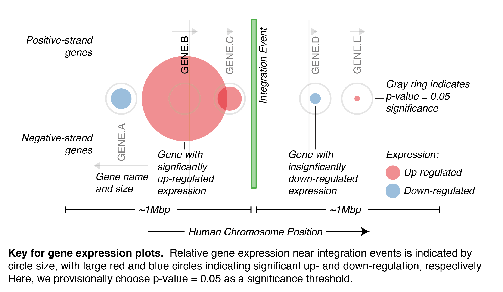
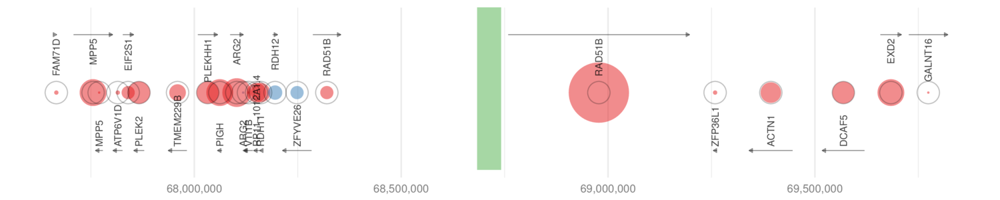

# BPS Expression Plot 

*Create BPS Expression plot based on expression P-values and save as PDF*

Expression plots illustrate the degree of up- or down-regulation of genes in
the vicinity of an integration event (or any region of interest).
Disregulation for a given sample (case) is relative to a population of control
samples, and is expressed as P-values (or false discovery rate, FDR).  Smaller
P-values indicate a higher degree of disregulation.  Expression data can come
from precalculated [TCGA RSEM dataset](../M_RSEM_Expression/README.md), or calculated from RNA-Seq data directly
([RPKM](../L_Expression/README.md)).  Plots of both datasets are shown below.

## Expression Plot Key

Expression plots provide a compact visual representation of gene position, size, name, and strand information,
together with degree of disregulation relative to controls.  Larger "bubbles" indicate more disregulation,
with blue and red indicating down- and up-regulation, respectively.  
 

## TCGA-BA-4077-01 expression: RPKM Analysis

Virus integration occurs in gene *RAD51B*, and exons upstream and downstream
are treated independently (resulting in two *RAD51B* "genes").  We find
significant upregulation of *RAD51B* exons downstream of the integration event.  

## TCGA-BA-4077-01 expression: RSEM Analysis

Analysis of TCGA RSEM data yields similar results as the RPKM analysis.
